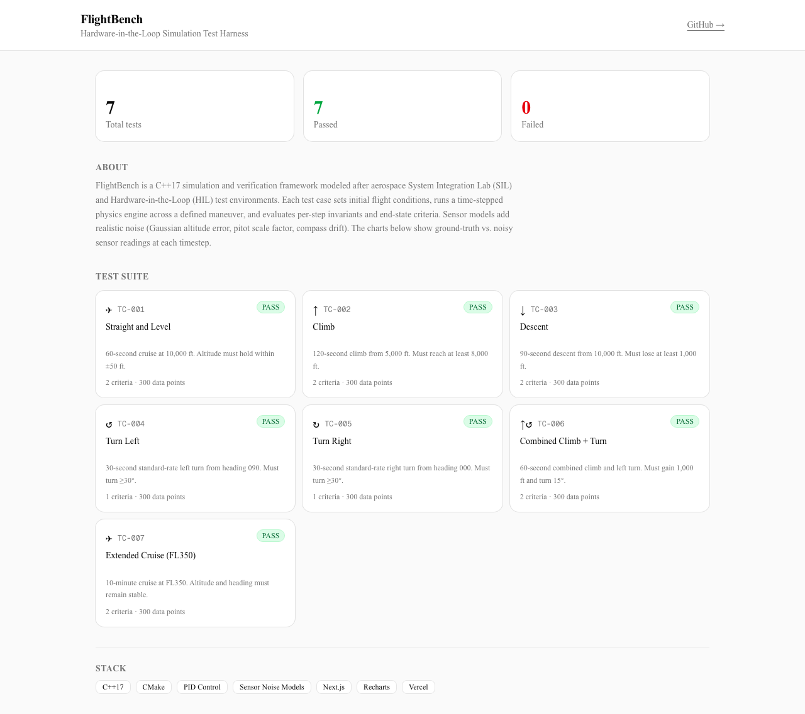
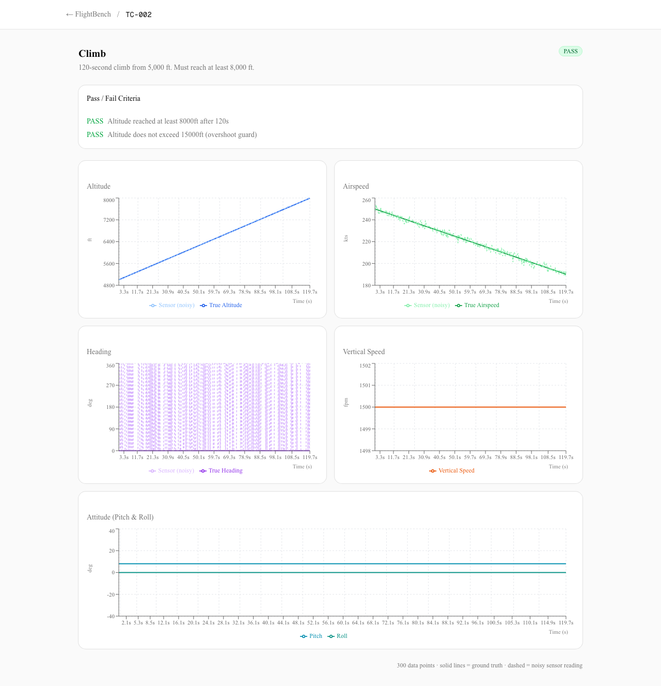

# FlightBench

**Live dashboard → [flightbench-dashboard.vercel.app](https://flightbench-dashboard.vercel.app)**

A Hardware-in-the-Loop (HIL) simulation and test harness written in C++17, modeled after real System Integration Lab (SIL) and HIL environments used in aerospace flight systems testing.





## What It Does

FlightBench simulates a flight system — sensors, a flight computer, and physics — then runs automated test cases against it, producing pass/fail verdicts and a written test report. The architecture mirrors the kind of work done in avionics SIL/HILS labs: you define initial conditions and a maneuver, the simulation runs time-stepped physics, and the test harness checks invariants (checked every step) and end-state criteria against defined limits.

## Architecture

```
include/
  simulation/     FlightState, SimEngine (time-stepped physics)
  sensors/        Sensor base class, AltitudeSensor, AirspeedSensor, HeadingSensor
  flight_computer/ FlightComputer (PID altitude/heading hold, warning logic)
  test_harness/   TestCase, TestResult, TestRunner, ReportGenerator
src/              Implementations
tests/test_cases/ TestSuite — 7 test cases covering all flight scenarios
reports/          Generated test reports (plain text)
```

**Key components:**

- **SimEngine** — drives flight physics at 0.1s timesteps. Supports 6 scenarios: straight-and-level, climb, descent, turn left/right, and combined climb+turn. Integrates altitude (ft), heading (deg), and airspeed (kts) with realistic physics.
- **Sensors** — altitude (barometric, Gaussian noise + bias), airspeed (pitot-static, scale factor error), heading (magnetic, drift model). Each reads from `FlightState` and adds independent noise.
- **FlightComputer** — PID altitude hold, proportional heading hold, throttle-based airspeed hold. Outputs commanded vertical speed, roll, throttle, and generates overspeed/stall warnings. This is the primary "software under test."
- **TestRunner** — executes test cases: sets initial conditions, runs the simulation, evaluates invariants per-step and criteria at end-of-run, collects pass/fail verdicts and invariant violation counts.
- **ReportGenerator** — color-coded console output + plain-text report file with per-criterion verdicts.

## Test Suite

| ID | Name | Duration |
|----|------|----------|
| TC-001 | Straight and Level — Altitude Stability | 60s |
| TC-002 | Climb — Altitude Gain | 120s |
| TC-003 | Descent — Controlled Altitude Loss | 90s |
| TC-004 | Turn Left — Heading Change | 30s |
| TC-005 | Turn Right — Heading Change | 30s |
| TC-006 | Combined Climb and Turn | 60s |
| TC-007 | Extended Duration Stability (cruise at FL350) | 600s |

Each test case specifies initial conditions, a scenario, pass/fail criteria evaluated at end-of-run, and invariants evaluated every time step (e.g., altitude must stay above ground, airspeed must stay above stall speed).

## Build

Requires: CMake 3.16+, a C++17 compiler (GCC, Clang, MSVC).

```bash
cmake -B build -DCMAKE_BUILD_TYPE=Release
cmake --build build --parallel
```

## Run

```bash
./build/flightbench                        # writes report to reports/test_report.txt
./build/flightbench my_report.txt          # custom report path
```

The executable exits with code `0` if all tests pass, `1` if any fail.

## Extending

**Add a new test case** — add an entry to `tests/test_cases/TestSuite.h`. Define a `TestCase` with initial conditions, scenario, duration, criteria lambdas, and optional invariant lambdas.

**Add a new scenario** — add a variant to the `Scenario` enum in `SimEngine.h` and handle it in `SimEngine::applyPhysics()`.

**Add a new sensor** — subclass `Sensor`, implement `read()`, and wire it into whatever uses sensor data.

**Add a new flight computer mode** — extend `FCOutput` and add logic to `FlightComputer::process()`.
